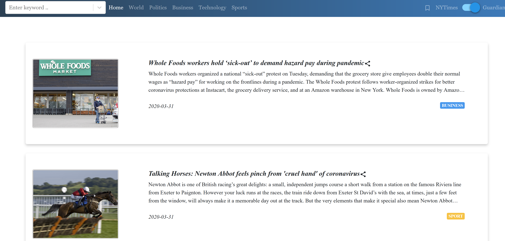
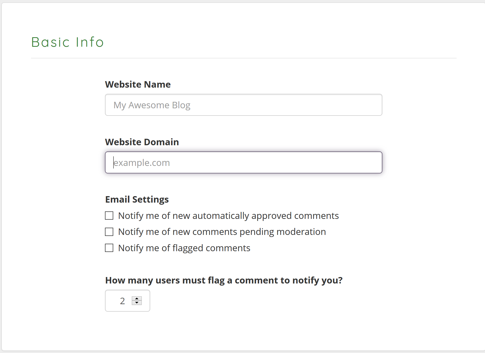

## A news website based on React.js and Node.js 

- Support switch from  top headlines for both New York Times and Guardian News.
- Top-headlines  could  be  for  any  of  the following domains –world, politics, business, technology and sports.
- Each such article can be shared by the user on Facebook, Twitter or via Email.
- Support both desktop and mobile browsers.
- Support autocomplete search and comment on each news.
- Support saving favorite news and removing them.

### Website overview

#### Desktop

#### Mobile

### Test locally
Go to the client repository: `cd dev/myclient`
Run: `npm install`
Run: `npm start`
Go to the server repository: `cd dev/myserver`
Run: `npm install`
Run: `npm start`

#### Config commentBox.io

To get started with the CommentBox.io API, visit: https://dashboard.commentbox.io/projects

Creat a project and enther localhost:3000 in the "web domain". This action makes commentBox.io working properly in your browser.

#### Check the website in your browser
Open browser on localhost:3000

### Deploy on Amazon EC2

 

1. Create an EC2 instance, make sure open TCP connections on port 3000(frontend) and 4000(backend).
Remember to edit all urls in `production/myserver/routers` to be your urls.
2. Download pem file. 
Run `chmod 400 [your pem file]` 
Connect your EC2 instance using
`ssh -i "[your_pem].pem" ubuntu@[your EC2 public DNS]`
3. Install curl
`sudo apt-get install curl`
Install node.js using curl
`curl -sL https://deb.nodesource.com/setup_10.x | sudo bash -`
`sudo apt-get install -y nodejs`
4. Install PM2
`sudo npm install pm2@latest -g`
5. Download code into your EC2 instance. 
6. Run `npm install` in `production/myclient`
7. Run `npm build` in `production/myclient`
8. Run `npm install` in `production/myserver`
9. Go to directory `production/`
`pm2 start myapp.config.js`
10. Go to your commentbox.io's dashboard and put [your EC2 public DNS:3000] into the "web domain"
11. Check the website in your EC2 public DNS.
